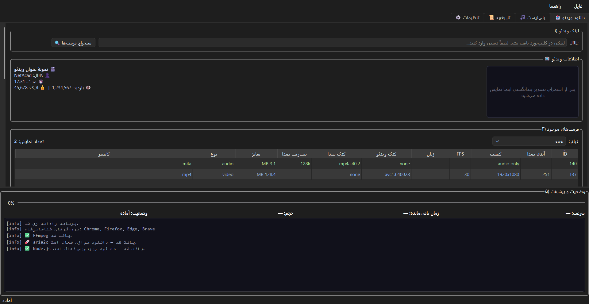

<div align="center">

# 🎬 دانلودر یوتیوب فارسی
### Persian YouTube Downloader

**یک دانلودر گرافیکی سریع، زیبا و حرفه‌ای برای یوتیوب** — ساخته‌شده با `Python` ،`PyQt6` و `yt-dlp`

*A fast, beautiful & professional GUI YouTube downloader — built with `Python`, `PyQt6` & `yt-dlp`*

<br>

[](https://www.python.org/)
[](https://www.qt.io/)
[](https://github.com/yt-dlp/yt-dlp)
[](https://github.com/salemhamidani/Persian_Youtube_Downloader)
[](LICENSE)
[](https://github.com/salemhamidani/Persian_Youtube_Downloader/releases)
[](https://github.com/salemhamidani/Persian_Youtube_Downloader/releases)

<br>

| 🇮🇷 فارسی | 🇬🇧 English |
|:---:|:---:|
| دانلود ویدئو و صوت از یوتیوب با رابط کاربری گرافیکی | Download YouTube video & audio with a GUI |

</div>

---

## 📥 دانلود | Download

> 🚀 **آخرین نسخه:** `v1.0.0`

| پلتفرم | فایل | لینک |
|--------|------|------|
| 🪟 **Windows x64** | `Persian_Youtube_Downloader-v1.0.0-windows-x64.zip` (~۵۶MB) | [⬇️ دانلود](https://github.com/salemhamidani/Persian_Youtube_Downloader/releases/download/v1.0.0/Persian_Youtube_Downloader-v1.0.0-windows-x64.zip) |

**فارسی:** نسخه قابل حمل ویندوز را دانلود و استخراج کنید، سپس `Persian_Youtube_Downloader.exe` را اجرا کنید — بدون نیاز به نصب پایتون یا هیچ وابستگی دیگر.

**English:** Download the portable Windows build, extract it, and run `Persian_Youtube_Downloader.exe` — no Python or any dependency required.

> 📦 همه نسخه‌ها در صفحه [Releases](https://github.com/salemhamidani/Persian_Youtube_Downloader/releases) موجود است.

---

## ✨ معرفی | Overview

**فارسی:** این پروژه یک دانلودر دسکتاپ یوتیوب با رابط گرافیکی (GUI) است که بر پایه موتور قدرتمند `yt-dlp` ساخته شده. شما لینک ویدئو را وارد می‌کنید، برنامه تمام فرمت‌های موجود (کیفیت، کدک، زبان، بیت‌ریت و حجم) را در یک جدول حرفه‌ای نمایش می‌دهد و می‌توانید دقیقاً همان کیفیت یا ترکیب دلخواه (مثل `137+140`) را دانلود کنید.

**English:** This is a desktop YouTube downloader with a graphical interface (GUI) built on the powerful `yt-dlp` engine. Paste a video link, browse every available format (quality, codec, language, bitrate & size) in a professional table, and download exactly the quality or combination you want (e.g. `137+140`).

> 💡 **چرا این پروژه؟** چون اکثر دانلودرهای موجود یا CLI هستند یا رابط کاربری ضعیفی دارند. این پروژه تجربه‌ای **کاملاً فارسی، راست‌به‌چپ و بصری** ارائه می‌دهد.

---

## 🚀 ویژگی‌ها | Features

| ✨ ویژگی | Feature | توضیح |
|---------|---------|-------|
| 📋 **تشخیص خودکار لینک** | Auto clipboard detection | لینک یوتیوب را کپی کنید؛ برنامه خودش آن را بارگذاری می‌کند |
| 🎚️ **استخراج همه فرمت‌ها** | Full format extraction | کیفیت، FPS، زبان، کدک ویدئو/صدا، بیت‌ریت و حجم |
| 🔍 **فیلتر هوشمند** | Smart filtering | فقط ویدئو / فقط صدا / ویدئو+صدا / بالاترین کیفیت هر رزولوشن |
| 🎵 **دانلود فقط صدا** | Audio-only mode | استخراج با FFmpeg در قالب `mp3` ،`m4a` ،`opus` ،`flac` ،`wav` |
| 🍪 **پشتیبانی کوکی** | Cookie support | کوکی مرورگر (Chrome/Firefox/Edge/…) یا فایل `cookies.txt` |
| ⚡ **سرعت بالا** | High-speed download | دانلود همزمان ۸ قطعه + چانک ۱۰MB + دانلودر خارجی `aria2c` |
| 📊 **پیشرفت زنده** | Live progress | سرعت، زمان باقی‌مانده، حجم و لاگ لحظه‌ای |
| 🎵 **دانلود پلی‌لیست** | Playlist download | استخراج لیست ویدئوها، انتخاب تکی/گروهی و دانلود انتخابی |
| 🎚️ **انتخاب کیفیت پلی‌لیست** | Playlist quality | انتخاب کیفیت (4K/1440p/1080p/720p/…) برای همه ویدئوها |
| 📏 **حجم هر ویدئو** | Per-video size | نمایش حجم تقریبی/واقعی هر ویدئو برای کیفیت انتخابی |
| 💬 **دانلود زیرنویس** | Subtitle download | زیرنویس دستی + خودکار با انتخاب زبان (نیازمند PO Token) |
| 📜 **تاریخچه دانلود** | Download history | ثبت خودکار دانلودهای انجام‌شده + پاک‌کردن |
| 🌐 **پشتیبانی پراکسی** | Proxy support | پروکسی `http` / `socks5` / `socks4` / `https` |
| 🖱️ **رابط راست‌به‌چپ** | RTL interface | کاملاً فارسی با چیدمان راست‌به‌چپ |
| 📑 **تب‌بندی** | Tabs | تب‌های «دانلود ویدئو»، «پلی‌لیست» و «تاریخچه» |
| 🌙 **تم تیره** | Dark theme | استایل مدرن QSS با رنگ‌های نئونی |
| 📋 **منوی برنامه** | Menu bar | فایل (خروج `Ctrl+Q`) + راهنما (`F1` و درباره) |
| ⏳ **صف دانلود** | Download queue | دانلود چند ویدئو پشت‌سرهم + مدیریت صف |
| 🎯 **ستون آیدی صدا** | Audio ID column | نمایش بهترین فرمت صدا برای ترکیب آسان با فرمت ویدئو |
| ✅ **تیک سبز** | Green checkmark | علامت سبز برای ویدئوهای دانلودشده در پلی‌لیست |
| 📁 **پوشه پلی‌لیست** | Playlist folder | ذخیره ویدئوهای هر پلی‌لیست در پوشه‌ای به نام همان پلی‌لیست |
| 🪟 **پیشرفت تسک‌بار** | Taskbar progress | نمایش درصد دانلود روی آیکون تسک‌بار ویندوز |
| 🛡️ **دور زدن SABR** | SABR workaround | بازیابی فرمت‌های کامل DASH با کلاینت `web_creator` |

---

## 📸 اسکرین‌شات | Screenshot

<div align="center">
  
  <p><em>رابط کاربری دانلودر یوتیوب فارسی — Persian YouTube Downloader GUI</em></p>
</div>

---

## 📦 پیش‌نیازها | Requirements

| ابزار | Tool | ضروری؟ | نقش |
|-------|------|:------:|-----|
| **Python** | 3.14+ | ✅ بله | اجرای برنامه |
| **yt-dlp** | 2026.8+ | ✅ بله | موتور دانلود |
| **PyQt6** | 6.11+ | ✅ بله | رابط گرافیکی |
| **FFmpeg** | — | ✅ بله | استخراج صدا و ادغام ویدئو/صدا |
| **Node.js** | 22+ | ✅ برای زیرنویس | تولید PO Token (دانلود زیرنویس) |
| **aria2c** | — | ⭕ اختیاری | دانلود موازی سریع‌تر |

> ⚠️ **FFmpeg ضروری است.** برای دانلود صدا (mp3) و ادغام ویدئو+صدا به FFmpeg نیاز دارید. راهنمای نصب:
> ```bash
> # ویندوز (با winget)
> winget install Gyan.FFmpeg
>
> # لینوکس
> sudo apt install ffmpeg
>
> # مک
> brew install ffmpeg
> ```

---

## 🔑 راه‌اندازی PO Token Provider | PO Token Provider Setup

> 📌 **چرا لازم است؟** از سال ۲۰۲۶ یوتیوب برای دانلود زیرنویس به «PO Token» نیاز دارد. بدون آن، دانلود زیرنویس با خطای `Did not get any data blocks` مواجه می‌شود. این راه‌نما را **یک‌بار** انجام دهید.

### ۱) نصب Node.js (الزامی برای زیرنویس)

اگر Node.js نسخه **۲۲ یا بالاتر** نصب نباشد، برنامه هنگام اجرا پیام هشدار نشان می‌دهد.

```bash
# ویندوز (با winget)
winget install OpenJS.NodeJS.LTS
```

### ۲) نصب وابستگی‌های Python

```bash
pip install -r requirements.txt
# شامل: curl_cffi (Impersonation) + bgutil-ytdlp-pot-provider (PO Token)
```

### ۳) راه‌اندازی سرور PO Token

```bash
# کلون ریپو (نسخه 2.0.0) در پوشه خانگی
git clone --single-branch --branch 2.0.0 https://github.com/Brainicism/bgutil-ytdlp-pot-provider.git ~/bgutil-ytdlp-pot-provider
cd ~/bgutil-ytdlp-pot-provider/server

# بیلد اسکریپت تولید توکن (با Node.js)
npm ci
npx tsc
```

### ۴) اجبار استفاده از Node.js (اختیاری)

اگر هم Node.js و هم Deno نصب باشند، Deno اولویت می‌گیرد و ممکن است خطا بدهد. برای استفاده از Node.js:

```bash
mv src/generate_once.ts src/generate_once.ts.disabled
```

### ۵) تست

```bash
yt-dlp --write-auto-subs --sub-langs en --skip-download "https://www.youtube.com/watch?v=VIDEO_ID"
```

اگر فایل `.srt` ساخته شد، PO Token درست کار می‌کند. ✅

---

## 🛠️ نصب | Installation

### فارسی

```bash
# ۱) کلون کردن مخزن
git clone https://github.com/salemhamidani/Persian_Youtube_Downloader.git
cd Persian_Youtube_Downloader

# ۲) ساخت محیط مجازی (پیشنهادی)
python -m venv venv

# ۳) فعال‌سازی محیط مجازی
# ویندوز:
venv\Scripts\activate
# لینوکس/مک:
source venv/bin/activate

# ۴) نصب وابستگی‌ها
pip install -r requirements.txt

# ۵) اجرای برنامه
python main.py
```

### English

```bash
git clone https://github.com/salemhamidani/Persian_Youtube_Downloader.git
cd Persian_Youtube_Downloader
python -m venv venv
# Windows: venv\Scripts\activate   |   Linux/macOS: source venv/bin/activate
pip install -r requirements.txt
python main.py
```

---

## 📦 ساخت نسخه قابل حمل (exe) | Build Portable EXE

می‌توانید یک نسخه قابل حمل بسازید که روی سیستم میزبان **بدون نیاز به نصب پایتون، کتابخانه‌ها، ffmpeg یا aria2c** اجرا شود.

### پیش‌نیاز ساخت

```bash
pip install pyinstaller
```

### ۱) ساخت exe

```bash
pyinstaller Persian_Youtube_Downloader.spec --noconfirm
```

خروجی در `dist/Persian_Youtube_Downloader/` ساخته می‌شود:

```
dist/Persian_Youtube_Downloader/
├── Persian_Youtube_Downloader.exe
└── _internal/          ← کتابخانه‌ها + ffmpeg + ffprobe + aria2c
```

### ۲) ساخت ZIP برای انتقال

```bash
python -c "import shutil; shutil.make_archive('Persian_Youtube_Downloader', 'zip', 'dist/Persian_Youtube_Downloader')"
```

فایل `Persian_Youtube_Downloader.zip` ساخته می‌شود (~۵۶MB).

### چه چیزهایی باندل می‌شوند؟

| آیتم | وضعیت |
|------|:------:|
| Python + PyQt6 + yt-dlp + curl_cffi + پلاگین PO Token | ✅ باندل |
| ffmpeg + ffprobe (استخراج صدا + ادغام) | ✅ باندل |
| aria2c (دانلود موازی) | ✅ باندل |
| **Node.js + سرور PO Token** | ⚠️ برای **زیرنویس** روی سیستم میزبان لازم است |

> 💡 دانلود ویدئو/صدا/پلی‌لیست در نسخه exe کاملاً بدون وابستگی است؛ فقط **زیرنویس** به Node.js (و سرور PO Token) نیاز دارد که برنامه در نبود آن هشدار می‌دهد.

### استفاده در سیستم میزبان

1. فایل ZIP را منتقل و استخراج کنید.
2. `Persian_Youtube_Downloader.exe` را اجرا کنید.

### 📤 انتشار در گیتهاب (GitHub Release)

برای انتشار نسخه در گیتهاب (با شماره نسخه و ریلیس‌های مختلف):

**روش خودکار (توصیه‌شده):** کافی است یک تگ نسخه push کنید — ورکفلو `.github/workflows/release.yml` به‌صورت خودکار exe را می‌سازد و Release می‌کند:

```bash
# شماره نسخه را در version.py بالا ببرید، سپس:
git add -A && git commit -m "نسخه 1.1.0" && git push
git tag v1.1.0 && git push origin v1.1.0
```

**روش دستی:** وقتی exe را خودتان ساخته‌اید:

```bash
# ZIP بسازید
python -c "import shutil; shutil.make_archive('Persian_Youtube_Downloader-v1.1.0-windows-x64', 'zip', 'dist/Persian_Youtube_Downloader')"

# Release بسازید
gh release create v1.1.0 "Persian_Youtube_Downloader-v1.1.0-windows-x64.zip" --title "v1.1.0" --generate-notes
```

---

## 🎯 نحوه استفاده | Usage

1. **لینک را کپی کنید** — برنامه به‌طور خودکار لینک را از کلیپ‌بورد تشخیص می‌دهد (یا دستی وارد کنید).
2. **روی «استخراج فرمت‌ها» بزنید** — جدول کامل فرمت‌ها نمایش داده می‌شود.
3. **فرمت دلخواه را انتخاب کنید** — یا از جدول، یا ID مستقیم (مثل `137+140`).
4. **مسیر ذخیره و تعداد تلاش مجدد را تنظیم کنید.**
5. **روی «شروع دانلود» بزنید** — پیشرفت زنده را تماشا کنید! 🎉

> 💡 **نکته:** برای دانلود فقط صدا، تیک «فقط صدا (استخراج با FFmpeg)» را بزنید و قالب دلخواه (mp3 و…) را انتخاب کنید.

### 🎵 دانلود پلی‌لیست

1. لینک پلی‌لیست (مثل `youtube.com/playlist?list=...` یا `watch?v=...&list=...`) را وارد کنید.
2. روی «استخراج فرمت‌ها» بزنید — لیست ویدئوها با حجم تقریبی نمایش داده می‌شود.
3. **کیفیت دلخواه** را از کامبو انتخاب کنید.
4. ویدئو(های) موردنظر را **تیک** بزنید (یا «انتخاب همه»).
5. روی «دانلود انتخاب‌شده» بزنید.

> 📏 حجم هر ویدئو بر اساس کیفیت انتخابی به‌صورت تدریجی محاسبه و نمایش داده می‌شود.

### 💬 دانلود زیرنویس

1. در بخش «ذخیره‌سازی و دانلود»، تیک **«زیرنویس → دانلود»** را بزنید.
2. زبان‌ها را وارد کنید (مثلاً `fa,en` یا `all`).
3. اگر زیرنویس فقط خودکار است، تیک «خودکار» را هم بزنید.

> ⚠️ زیرنویس نیازمند راه‌اندازی **PO Token Provider** است (بخش بالا). اگر Node.js نصب نباشد، برنامه هشدار می‌دهد.

---

## 📁 ساختار پروژه | Project Structure

```
Persian_Youtube_Downloader/
├── main.py           → نقطه ورود برنامه (entry point)
├── gui.py            → رابط کاربری گرافیکی (PyQt6) + منو + تسک‌بار
├── ui_builder.py     → ساخت ویجت‌های UI (میکسین)
├── ui_utils.py       → ثابت‌ها و توابع کمکی UI (تم تیره، delegate تیک سبز)
├── downloader.py     → منطق دانلود، زیرنویس و استخراج فرمت‌ها (yt-dlp)
├── taskbar.py        → پیشرفت تسک‌بار ویندوز (ITaskbarList3)
├── cookies.py        → شناسایی مرورگرها و مدیریت فایل کوکی
├── settings.py       → ذخیره/بازیابی تنظیمات و تاریخچه (JSON)
├── version.py        → شماره نسخه برنامه
├── make_icon.py      → تولید آیکون برنامه
├── assets/           → آیکون‌های برنامه (png/ico)
├── tests/            → تست‌های unit
├── .github/workflows/ → ورکفلو خودکار Build & Release
├── Persian_Youtube_Downloader.spec → پیکربندی PyInstaller
├── requirements.txt  → وابستگی‌های پروژه (شامل PO Token)
├── README.md         → مستند پروژه (فارسی/انگلیسی)
├── LICENSE           → مجوز MIT
├── docs/
│   └── screenshot.png → اسکرین‌شات برنامه
└── .gitignore        → فایل‌های نادیده‌گرفته‌شده (شامل کوکی‌ها)
```

| فایل | File | مسئولیت |
|------|------|---------|
| `main.py` | entry point | اجرای برنامه |
| `gui.py` | UI (PyQt6) | پنجره اصلی، جدول فرمت‌ها، پلی‌لیست، تاریخچه، منو، تسک‌بار |
| `ui_builder.py` | UI builder | ساخت ویجت‌ها (تب‌ها، جدول‌ها، دکمه‌ها) به‌صورت میکسین |
| `ui_utils.py` | UI helpers | ثابت‌ها، regex لینک، گزینه‌های کیفیت، تم تیره، delegate تیک سبز |
| `downloader.py` | download engine | ساخت پارامترهای yt-dlp، دانلود، زیرنویس، پارس فرمت‌ها |
| `taskbar.py` | taskbar progress | پیشرفت روی آیکون تسک‌بار ویندوز (ITaskbarList3) |
| `cookies.py` | cookie manager | تشخیص مرورگر، اعتبارسنجی کوکی |
| `settings.py` | settings | ذخیره تنظیمات و تاریخچه در `~/.youtube_downloader/config.json` |
| `version.py` | version | شماره نسخه برنامه |
| `tests/` | unit tests | تست‌های دانلودر، تنظیمات، کوکی، تسک‌بار و توابع UI |

---

## 🔒 نکات امنیتی | Security Notes

> 🚨 **مهم:** فایل `cookies.txt` حاوی **توکن‌های ورود حساب گوگل/یوتیوب شما** است. این فایل **هرگز نباید** commit یا به اشتراک گذاشته شود — به همین دلیل در `.gitignore` قرار گرفته است.

| ✅ امن | ❌ ناامن |
|-------|---------|
| استفاده از کوکی مرورگر (`cookiesfrombrowser`) | قرار دادن `cookies.txt` در مخزن |
| `.gitignore` شامل کوکی و فایل‌های حساس | به‌اشتراک‌گذاری کوکی با دیگران |
| اعتبارسنجی SSL فعال (`nocheckcertificate: False`) | غیرفعال‌کردن بررسی گواهی SSL |

---

## 🧪 عیب‌یابی | Troubleshooting

| مشکل | Problem | راه‌حل |
|------|---------|--------|
| «ffmpeg not found» | ffmpeg missing | FFmpeg را نصب کنید (بخش پیش‌نیازها) |
| دانلود کند | slow download | `aria2c` را نصب کنید تا دانلود موازی فعال شود |
| خطای کوکی | cookie error | مرورگر را ببندید یا از فایل `cookies.txt` تازه استفاده کنید |
| فرمت نمایش داده نمی‌شود | formats not shown | از کوکی معتبر استفاده کنید (YouTube محدودیت اعمال می‌کند) |
| «Did not get any data blocks» در زیرنویس | subtitle PO token error | PO Token Provider را راه‌اندازی کنید (بخش راه‌اندازی PO Token) |
| ویدئو بدون زیرنویس دانلود شد | video without subtitle | تیک «خودکار» را بزنید (اکثر ویدئوها فقط زیرنویس خودکار دارند) |

---

## 🤝 مشارکت | Contributing

از مشارکت شما استقبال می‌کنیم! 🎉

1. مخزن را **Fork** کنید.
2. یک شاخه جدید بسازید: `git checkout -b feature/amazing-feature`
3. تغییرات را commit کنید: `git commit -m "Add amazing feature"`
4. به شاخه خود push کنید: `git push origin feature/amazing-feature`
5. یک **Pull Request** باز کنید.

---

## ⭐ حمایت | Support

اگر این پروژه برایتان مفید بود، با یک **ستاره ⭐** از آن حمایت کنید!

<br>

<div align="center">

**ساخته‌شده با ❤️ برای جامعه فارسی‌زبان**

*Made with ❤️ for the Persian-speaking community*

</div>
